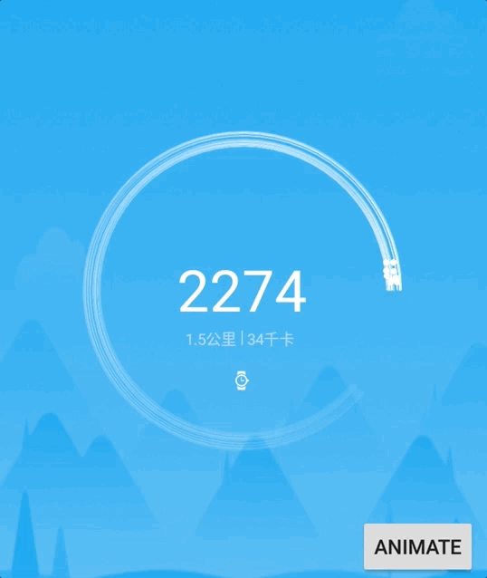

# HencoderKeyboard3
[HenCoder「仿写酷界面」活动——征稿](http://hencoder.com/activity-mock-1) <br>
[HenCoder「仿写酷界面」活动——获奖作品点评](http://hencoder.com/activity-mock-2/)
虽然4个作品均未命中奖项，但本人还是会持续优化....，敬请关注！！！

- 写作背景
在这个作品之前都是比较零散的搞一个比较好的效果仿写，比如我之前仿写 QQ 健康效果。 hencoder 这个系列很完整，比之其他博主写的形式更加通俗易懂，我觉得这些都是次要的，都是知识获取渠道，最重要的是将知识落地。这场比赛我觉得很好，投稿、点评很能够调用一个开发者的兴趣。说实话在邀请投稿文章出来之后，自定义 View 经验不是很丰富的我居然在十几个小时就连续将4个作品全部仿写出来投稿了，可以说是调动了我很高的兴趣和潜力。当然作品还是有很多欠缺的地方，我会不断的进行完善。
## 下载
[demo.apk](app/build/outputs/apk/debug/app-debug.apk)

# 即刻点赞
- 写在前面
获奖作品[ThumbUpSample](https://github.com/arvinljw/ThumbUpSample)<br>
```
    在揭晓优胜者之后我对比了实现原理，基本原理就是左边炫丽的效果和右边文字上下滚动分离。我在左边的效果实现上忘记了一个光圈的缩放，当时以为是鼠标自己的效果....，比较遗憾！
```
- 实现原理
```
实现原理：隔离并复用图片动画和文字动画
LikeView自定义的LinearLayout默认组合点赞文字动画效果
LikeImageView
点赞图片动画
点赞效果
    灰色的点赞图标变小至0.9倍
    转变成红色的图标并且半透明
    红色图标逐渐增长至正常的1.1倍 / 透明度在增长至正常时逐渐变成实体 最后变成正常大小的红色图标
点赞伴随动画光圈
    0.6倍点赞图标大小的光圈、半透明
    0-50%动画完成度时半透明变成实体
    50%-100%动画完成度时实体又逐渐变成透明
    光圈半径逐渐增大至1.1倍
取消点赞效果
    红色图标变小至0.9倍且变成半透明 动画完成到一半时变成灰色的正常大小
闪光动画
    点赞时 闪光图标在点赞图标顶部的某个位置，先由小到大直至正常大小

LikeNumView
    点赞和取消赞动作导致的文字变化 转变成 原数字->新数字。点赞和取消赞时改动新数字的值(+1/-1)。将两个数字动转为字符串数组，从高位开始循环 如果数字相同就直接画数字，如果数字不同就开始绘制两个数字位移同时设置对应的透明渐变`
```
- 对比获奖作品
```
获奖作品之后并没有多大改动
    点赞散开点并没有做处理
我主要是在我原来的基础上将基本特效都实现了，包括点赞散开的效果
```
- 截图
<br>

# 薄荷健康尺

- 写在前面
获奖作品[BooheeRuler](https://github.com/totond/BooheeRuler)<br>
```
在揭晓获奖作品之后,看了当时的实现方式原理一致，中央高亮刻度覆盖尺子之上，尺子刻度值全部绘制出来，然后滑动内容。因为当时滑动交互算是hencoder的超纲内容，因而漏写了这一块很遗憾！
```
- 实现原理
```
分析：
    此控件分两块，下方尺子和上方显示的中央刻度值。下方尺子中刻度内容可以滑动而在其上的中央高亮刻度固定。由上分析：将此控件分成两个view，rulerView和rulerNumerView
    rulerView:刻度要可以滑动即刻度是一个独立的View,上方固定的中央刻度则是ViewGroup在刻度子View绘制完成之后在上面覆盖绘制一个高亮的刻度线
    rulerNumberView:实时监听rulerView的刻度滚动经过中央高亮刻度线时的值显示
```
- 对比获奖作品
```
获奖作品在众星捧月中不断进步,截止0.1.3版本
    功能上：实现了尺子的左上右下的四种显示方向
    性能上：每次重绘只绘制当前显示部分刻度
我觉得它已经做的很完美了，但是我觉得还是有些补足之处的。
    1.实现四种显示方向结构太臃肿、完全可以直接在InnerRuler中绘制刻度和文字等处做方向处理调整绘制坐标
    2.监听刻度值的View可以做的更加解耦一些，rulerView和rulerNumberView可以做到n:n
我这里在他的作品之上做了上面我所说的改造，因为时间关系我阉割了他边界阴影效果
```
- 截图


## 小米运动
获奖作品[MISportsConnectWidget](https://github.com/sickworm/MISportsConnectWidget)

- 写在前面
```
这个作品难点在于喷射的效果，因为经验较少直接采用了笨办法，稍微处理了一下随机算法。
最后看到有人实现这个效果之后真心佩服，原作者点评也很专业
```
- 实现原理
```
带粒子喷射的头部以及虚化线尾巴旋转效果
最终页面显示结果的外光晕旋转
```
- 作品对比
```
相形见绌啊，只讲我的缺点吧
粒子喷射效果没有已随机点击代替...
最终结果的外圈旋转光晕没有...
```
- 截图


## Fliboard 翻页效果
- 写在前面
```
这个是4个中我最先写出来的，稿子发出来之后，下班之前就发了出来。起初有点懵，当效果分拆成小块小块的时候，发现很容易实现，最后拼起来效果一致。
当这个作品没获奖的时候真的比较遗憾，可能是输给细节吧！
```
- 实现原理
```
将效果进行拆分成启动右侧的翻折、旋转翻折、结尾下方也翻折
难点在于如果实现旋转翻折，翻折部分和正常部分分开绘制。
带着翻折部分旋转：裁剪出翻折部分的canvas，将这部分canvs依照整体做旋转，然后将图片绘制在上面，最后反向旋转回来然后将这部分与正常部分拼接就完成了整个效果
```
- 作品对比
```
差异不大，获奖者比较鸡贼，图片采用他们最新的图标....
```

- 截图


## 关于我

简书 [keyboard3](http://www.jianshu.com/users/62329de8c8a6/latest_articles)<br>
邮箱 keyboard3@icloud.com
